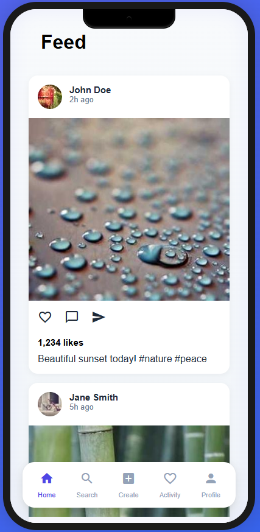
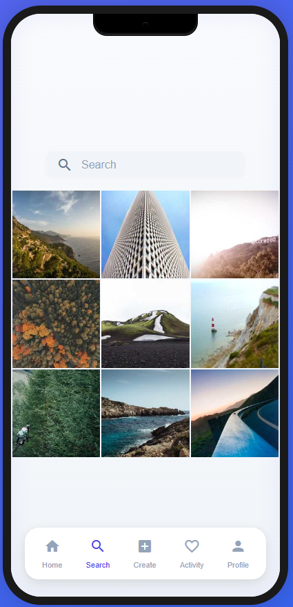
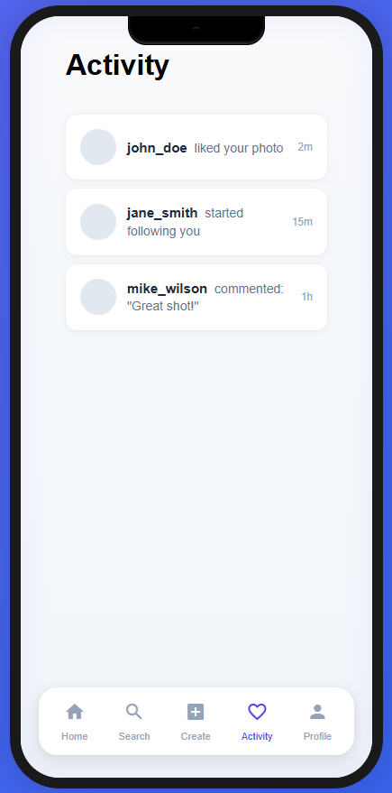
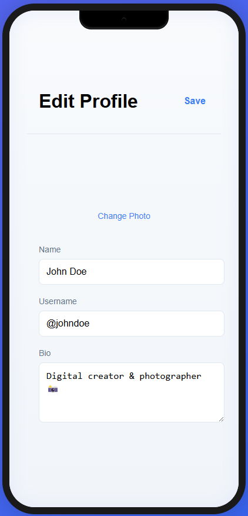
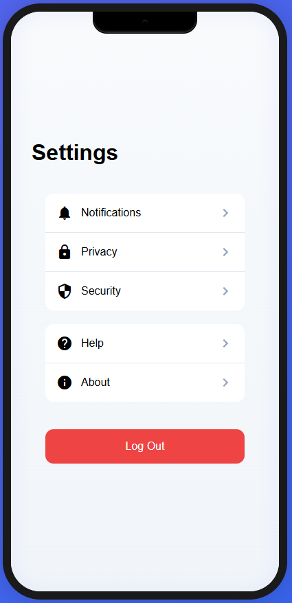

# Social App iOS

A modern social media application built with SwiftUI.

## Screenshots

### Authentication


### Main Features





### Profile & Settings




## Features

### Authentication & Security
- 🔐 Secure login and registration
- 📱 Social media authentication
- 🔑 Password recovery

### Content
- 📸 Photo sharing with filters
- 📝 Post creation with captions
- 🏷️ Hashtag support
- 📍 Location tagging

### Social
- ❤️ Like and comment on posts
- 👥 Follow/Unfollow users
- 🔔 Real-time notifications
- 🔍 User and content search

### Profile
- 👤 Customizable user profiles
- 📊 Activity statistics
- 🎨 Profile themes
- 🖼️ Grid and list view for posts

## Requirements

- iOS 15.0+
- Xcode 13.0+
- Swift 5.5+

## Installation

1. Clone the repository
```bash
git clone https://github.com/yourusername/social-app-ios.git

2. Install dependencies (if using CocoaPods)
```bash
pod install

3. Open the workspace file in Xcode
```bash
open SocialApp.xcworkspace

4. Build and run the app on a simulator or device

## Architecture
- MVVM Architecture
- SwiftUI for UI
- Combine for reactive programming
- Core Data for local persistence
- Unit Tests with XCTest

## Contributing
1. Fork the repository
2. Create your feature branch ( git checkout -b feature/amazing-feature )
3. Commit your changes ( git commit -m 'Add amazing feature' )
4. Push to the branch ( git push origin feature/amazing-feature )
5. Open a Pull Request

## License
This project is licensed under the MIT License - see the LICENSE file for details